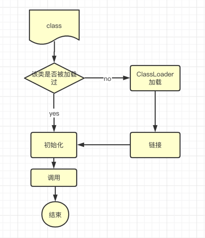

## 这两个方法的作用:

ClassLoader#loadClass(String name, boolean resolve) 和 Class.forName(String name, boolean init, ClassLoader loader)方法的作用是一样的，都是通过class的全界限名对class文件进行加载的，获取该类的二进制流然后保存到jvm中

class文件加载到jvm到流程：

其中验证、准备、解析阶段属于连接阶段

**核心的三个步骤:**

- 1.装载：就是找到class对应的字节码文件
- 2.连接：将对应的字节码读取到jvm中
- 3.初始化：对class做相应的初始化动作

## 两个方法的区别

ClassLoader#loadClass就是进行装载class，如果resolve为true的话，会进行连接准备，只有在使用到类的时候才会进行初始化等

Class#forName(String name, boolean init, ClassLoader loader)使用等也是ClassLoader进行加载的，会使用当前调用类的Classloader进行加载，也可以指定ClassLoader进行加载，init为true的时候会进行类初始化，即会初始化类中的静态代码块

因此jdbc的Driver必须要使用Class.forName进行加载，因为Driver必须要注册到DriverManager中

    static {
            try {
                DriverManager.registerDriver(new Driver());
            } catch (SQLException var1) {
                throw new RuntimeException("Can't register driver!");
            }
        }
