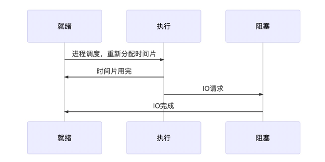

### 进程

进程，直观的说，程序运行以后会在内存空间里形成一个独立的内存体，这个内存体有自己独立的地址空间，有自己的堆，上级挂靠单位是操作系统。操作系统会以进程为单位，分配系统资源（CPU时间片、内存等资源），进程是资源分配的最小单元




### 线程

线程，有时会被称为轻量级进程，是操作系统调度(CPU调度)的最小单元，注意和进程的区别


### 协程

协程是一种用户态的轻量级线程，协程的调度完成由用户控制。协程拥有自己的寄存器上下文和栈。协程调度切换时，将寄存器上下文和栈保存到其他地方，在切回来的时候，恢复先前保存的寄存器上下文和栈，直接操做栈基本上没有内核切换的开销，可以不加锁的访问全局变量，所以上下文的切换特别的快。协程的子程序内不是可中断的，然后转而执行别的子程序，在适当的时候再返回来接着执行

### 进程和线程的区别和联系

**并发性**:不仅进程之间可以并发执行，同一个进程的多线程之间也可以并发执行

**拥有资源**:进程是拥有资源的一个独立单位，线程不拥有系统资源，但是可以访问率属于进程的资源

**系统开销**:多进程的程序要比多线程的要健壮，但是进程的切换，资源消耗的比较大，效率要差很多

线程和进程在使用上各有自己的优缺点，**线程执行开销小，但是不利于资源的保护和管理，而进程相反**。同时，线程适合于SMP机器上运行，而进程可以跨机器迁移

**协程和线程的区别：**

协程避免了无意义的调度，由此可以提升性能，但也因此程序员要负担协程的调度任务，同时协程也失去了标准线程使用多CPU的能力

**协程的和线程比的优点：**

1.极高的执行效率：因为子程序的切换不是线程的切换，而是由程序自己控制，因此，没有线程切换的开销，和多线程比，当线程数量越多的时候，协程的优势越明显

2.不需要多线程的锁机制：因为只有一个线程，也不存在同时是写变量的冲突，在协程控制共享资源不加锁，只需要判断状态就好，所以效率比多线程要高很多

**协程的缺点：**

1.无法利用多核资源：协程本质上是单线程，他不能同时将单个CPU的多核用上，协程需要和进程配合才能使用多个CPU

2.运行阻塞操作会阻塞掉整个程序

**线程和协程的最佳实践：**

1.线程和协程推荐在IO密集型任务中调用，如网络调用。而在CPU密集型中的任务，表型较差

2.对于CPU密集型任务，则需要多进程，既可以使用CPU多核，也可以提高效率

3.对于大并发的最佳实践就是多进程+协程，既可以利用多核，又能充分的发挥协程的高效率，可以获得极高的性能

### Java线程详解

线程Thread是一个程序的多个执行路径，执行调度单元，依托于进程的存在。线程不仅可以共享进程内存，还能拥有属于自己的内存空间，这块内存空间也叫做线程栈，
是在建立线程时由操作系统分配的，主要用来保存线程内部所用到的数据，如线程执行函数中所定义的变量。Java中的多线程是一种抢占机制，而不是分时机制。抢占
机制就是有多个线程处于运行状态，但是只允许一个线程在运行，他们通过抢占的方式占用CPU。

#### 线程方法

- static int activeCount() 返回当前线程的线程组里活动线程的数目
- void checkAccess() 判定当前运行的线程是否有权修改该线程
- static Thread currentThread() 返回对当前正在执行的线程对象引用
- void destroy() 已废弃，最初用于破坏该线程，但不做任何清除。它所保持的任何监视器都会保持锁定状态。不过该方法绝对不会呗实现，即便实现它极有可能以suspend()方式被死锁
- static void dumpStack() 将当前线程的堆栈跟踪打印到标准错误流
- static int enumerate(Thread[] array) 将当前线程的线程组及子组中的每一个活动线程复制到指定的数组中
- static Map<Thread, StackTraceElement[]> getAllStackTraces() 返回所在活动线程的堆栈跟踪的一个映射
- ClassLoader getContextClassLoader() 返回该线程的上下文 ClassLoader
- static Thread.UncaughtExceptionHandler getDefaultUncaughtExceptionHandler() 返回线程由于未捕获到异常而突然终止时调用的默认处理程序
- long getId() 返回该线程的标识符
- String getName() 返回该线程的名称
- int getPriority() 返回线程的优先级
- StackTraceElement[] getStackTrace() 返回一个表示该线程堆栈转储的堆栈跟踪元素数组
- Thread.State getState() 返回该线程的状态
- ThreadGroup getThreadGroup() 返回该线程所属的线程组
- Thread.UncaughtExceptionHandler getUncaughtExceptionHandler() 返回该线程由于未捕获到异常而突然终止时调用的处理程序
- static boolean holdsLock(Object obj) 当前仅当当前线程在指定的对象上保持监视器锁时，才返回true
- void interrupt() 中断线程
- static boolean interrupt() 测试当前线程是否已经中断
- boolean isAlive() 测试线程是否存于活动状态
- boolean isDaemon() 测试线程是否为守护线程
- boolean isInterrupt() 测试线程是否已中断
- void join() 等待该线程终止
- void join(long millis) 等待该线程终止的时间最长为millis毫秒
- void join(long millis, int nanos) 等待该线程终止的时间最长为 millis 毫秒 + nanos 纳秒。
- void resume() 已过时，该方法只与suspend()一起使用，但是suspend()已遭到反对，因为它具有死锁倾向
- void run() 如果该线程是使用独立的 Runnable 运行对象构造的，则调用该 Runnable 对象的 run 方法；否则，该方法不执行任何操作并返回
- void setContextClassLoader(ClassLoader cl) 设置该线程的上下文 ClassLoader
- void setDaemon(boolean on) 将该线程标记为守护线程或用户线程
- static void setDefaultUncaughtExceptionHandler(Thread.UncaughtExceptionHandler eh) 设置当线程由于未捕获到异常而突然终止，并且没有为该线程定义其他处理程序时所调用的默认处理程序
- static void sleep(long millis) 在指定的毫秒数内让当前正在执行的线程休眠（暂停执行），此操作受到系统计时器和调度程序精度和准确性的影响
- static void sleep(long millis, int nanos)  在指定的毫秒数加指定的纳秒数内让当前正在执行的线程休眠（暂停执行），此操作受到系统计时器和调度程序精度和准确性的影响
- void start() 使该线程开始执行；Java 虚拟机调用该线程的 run 方法
- void stop() 已过时，此方法具有固有的不安全性
- void stop(Throwable obj) 已过时，该方法具有固有的不安全性
- void suspend() 已过时，该方法已经遭到反对，因为它具有固有的死锁倾向
- static void yield() 暂停当前正在执行的线程对象，并执行其他线程

#### 线程状态

- 新生状态（New）： 当一个线程的实例被创建即使用new关键字和Thread类或其子类创建一个线程对象后，此时该线程处于新生(new)状态，处于新生状态的线程有自己的内存空间，但该线程并没有运行，此时线程还不是活着的（not alive）
- 就绪状态（Runnable）： 通过调用线程实例的start()方法来启动线程使线程进入就绪状态(runnable)；处于就绪状态的线程已经具备了运行条件，但还没有被分配到CPU即不一定会被立即执行，此时处于线程就绪队列，等待系统为其分配CPCU，等待状态并不是执行状态； 此时线程是活着的（alive）
- 运行状态（Running）： 一旦获取CPU(被JVM选中)，线程就进入运行(running)状态，线程的run()方法才开始被执行；在运行状态的线程执行自己的run()方法中的操作，直到调用其他的方法而终止、或者等待某种资源而阻塞、或者完成任务而死亡；如果在给定的时间片内没有执行结束，就会被系统给换下来回到线程的等待状态；此时线程是活着的（alive）
- 阻塞状态（Blocked）：通过调用join()、sleep()、wait()或者资源被暂用使线程处于阻塞(blocked)状态；处于Blocking状态的线程仍然是活着的（alive）
- 死亡状态（Dead）：当一个线程的run()方法运行完毕或被中断或被异常退出，该线程到达死亡(dead)状态。此时可能仍然存在一个该Thread的实例对象，当该Thready已经不可能在被作为一个可被独立执行的线程对待了，线程的独立的call stack已经被dissolved。一旦某一线程进入Dead状态，他就再也不能进入一个独立线程的生命周期了。对于一个处于Dead状态的线程调用start()方法，会出现一个运行期(runtime exception)的异常；处于Dead状态的线程不是活着的（not alive）

#### Thread.join()等待线程

很多情况，主线程启动了子线程，如果子线程里进行大量的耗时操作，主线程往往比子线程提前结束，但是有些情况主线程需要子线程结束完以后才能执行，这个时候就用到了join方法

- join()throws InterruptedException;  //无参数的join()等价于join(0),作用是一直等待该线程死亡
- join(long millis, int nanos) throws InterruptedException;  //最多等待该线程死亡millis毫秒
- join(long millis, int nanos) throws InterruptedException ; //最多等待该线程死亡millis毫秒加nanos纳秒

源码分析: 
```java
public final void join() throws InterruptedException {
    join(0L); //后面参数为wait的最大时间，如果是0表示永远等待直到该线程执行完毕
}

public final synchronized void join(long millis)  throws InterruptedException {
    long base = System.currentTimeMillis();
    long now = 0;
    if (millis < 0) {
        throw new IllegalArgumentException("timeout value is negative");
    }
    if (millis == 0) { //进入这个分支  
        while (isAlive()) { //判断本线程是否为活动的。这里的本线程就是t1.  
            wait(0); //阻塞  
        }
    } else {
        while (isAlive()) {
            long delay = millis - now;
            if (delay <= 0) {
            break;
        }
        wait(delay);
        now = System.currentTimeMillis() - base;
        }
    }
}
```

### Thread Sleep()和Wait()的区别

对于sleep()方法属于Thread类的方法，而wait()方法属于Object类中的。sleep用于线程控制的，而wait用于线程间通讯的

- sleep介绍

sleep是使当前线程进入阻塞状态的，让出CPU的使用，不让当前线程独自霸占该线程获取的CPU，该方法是Thread的方法，因此它不能改变
对象的锁，所以对一个sync的代码块中调用了sleep()方法是，线程虽然休眠了，但对象的锁没有释放，其他线程无法访问。sleep时间满足后，
不是一定会被执行，而是等待重新分配CPU

- wait介绍

wait是object的方法，当一个线程执行wait方法时，它就会进入到一个和该对象相关的等待池中，同时释放锁，wait(long timeout)超时
时间到了后还需要返还对象锁；其他对象可以访问。wait使用notify或者notifyAll方法来唤醒当前等待池中的线程。wait方法必须sync块中，否则会抛
IlleageMonitorStateException异常

#### 区别

- 区别1
sleep是Thread的方法，用来做线程控制的；wait是Object的方法，用来线程间通讯。
- 区别2
关于锁的释放，sleep不会释放锁，可以理解为本身也不归它管。而wait会释放锁
- 区别3
wait方法必须放到同步代码块中

### Thread.yield()线程协作让步

yield方法的作用是暂停当前线程，以便其他线程有机会执行，不过不能指定暂停时间，也不能保证当前线程马上停止，yield方法只是讲线程从Running状态
变为Runnable状态，重新竞争CPU，也就是有可能还会被重新分配到的，并不是调用此方法下一次一定不会被执行到。

### Thread.interrupt()中断线程

将会设置该线程的中断状态，设置为true，中断的结果就是线程是死亡、还是等待新的任务或者继续运行至下一步，就取决于线程本身。线程会不断检测这个中断位标识，
以判断是否应该被中断，不会像stop方法一样直接中断一个在运行的线程

- 线程中断自己是被允许的，但是其他线程调用的时候，需要通过checkAccess检查权限，可能会排查SecurityException
- 如果线程本身处于阻塞状态，调用wait、sleep、join方法进入阻塞状态时，如果调用了interrupt方法，那么它的中断状态会被清除并收到一个InterruptException异常
- 如果现线程阻塞在一个Selector选择器中，那么通过interrupt中断它时，线程的中断标识会被设置为true，并且他会立即从选择操作中返回
- 如果不属于前面所说的情况，那么通过interrupt中断线程时，它的中断标记会被设置为true
- 中断一个已终止的线程不会产生任何操作

