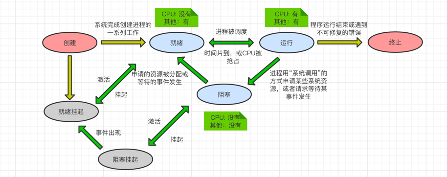

### 调度的基本概念

- 当有一堆任务要处理，但由于资源有限，这些任务没法同时处理，这就需要确定某种规则来决定处理这些任务的顺序，这就是"调度"研究的问题

- 在多道程序系统中，进程的数量往往是高于处理器的个数的，这样不可能同时并行的处理各个进程。处理机调度就是从就绪队列中按照一定的算法选择
一个进程并将处理机分配给它运行，以实现进程的并发执行
  

### 调度的三个层次 - 高级调度

- 由于内存空间有限，有时无法将所有用户提交的作业全部放入内存，因此就需要确定某种规则来决定将作业调入内存的顺序

- 高级调度(作业调度)，按一定的原则从外存上(如磁带)上处于后备队列的作业中挑选一个(或多个)作业，给他们分配内存等必要资源，并建立相应的进程(PCB)，
以使它们获得竞争处理机的权利
  
- 高级调度是外存与内存之间的调度，每个作业只能被调入一次，调出一次。作业调入时会创建相应的PCB，作业调出的时候会撤销PCB。高级调度主要是指调入的问题，
因为只有调入的时机需要操作系统来确定，但调出的时机必然是作业结束才能调出
  
### 调度的三个层次 - 中级调度

- 引入虚拟存储技术之后，可将暂时不能运行的进程调至外存等待，等它重新具备了运行条件且内存又稍有空闲的时候，再重新调入内存

- 这样做的目的主要是为了提高内存的利用率和系统的吞吐量

- 暂时调到外存等待的进程状态称为挂起状态，值得注意的是，PCB并不会一起调到外存，而是会常驻内存。PCB中会记录进程数据在外存中的存放位置，进程状态信息，
操作系统通过内存的PCB来保持对各个进程的监控、管理。被挂起的进程PCB会被放到挂起队列中
  
- 中级调度(内存调度)，就是要决定将哪个处于挂起状态的进程重新调入内存，一个进程可能会被多次调入、调出内存，因此中级调度发生的频率要比高级调度更高

---

- 补充知识: 进程的挂起状态和七状态模型

    - 暂时调到外存等待的进程状态为挂起态(suspend)
    - 挂起态进一步可以分为就绪挂起以及阻塞挂起两种状态
    - 阻塞和挂起的区别
        - 两种状态都不能获取CPU的服务，但是挂起是被调入到外存，而阻塞还在内存
        - 有的操作系统会把就绪挂起、阻塞挂起分为两个挂起队列，甚至根据阻塞原因的不同再把阻塞挂起进程进一步分为多个队列

### 调度的三个层次 - 低级调度

- 低级调度(进程调度)，其主要任务是按照某种方法和策略从就绪队列中选取一个进程，将处理机分配给它

- 进程调度是操作系统中最基本的一种调度，在一般的操作系统中都必须配置进程调度

- 进程调度的频率很高，一般几十毫秒一次

### 三层调度的联系、对比

调度的层次 | 要做什么事情 | 调度发生在哪里 | 发生频率 | 对进程的状态影响 |
|---|---|---|---|---|
高级调度 作业调度 | 按照某种规则，从后备队列中选择合适的任务调入内存，为其创建进程 | 外存 -> 内存   面向作业 | 最低 | 无 -> 创建 -> 就绪态
中级调度 内存调度 | 按照某种规则，从挂起队列中选择合适的进程将其数据调回内存 | 外存 -> 内存   面向内存 | 中等 | 挂起态 -> 就绪态   (阻塞挂起状态 -> 阻塞态)
低级调度 进程调度 | 按照某种规则，从就绪队列中选择一个进程围棋分配处理器 | 内存 -> cpu | 最高 | 就绪态 -> 运行态

